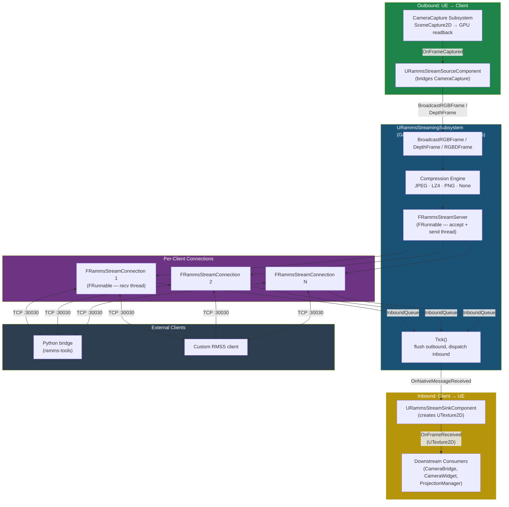
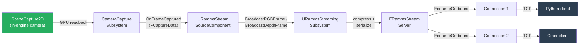
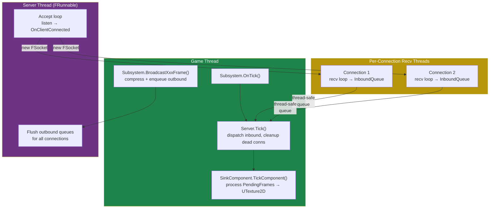
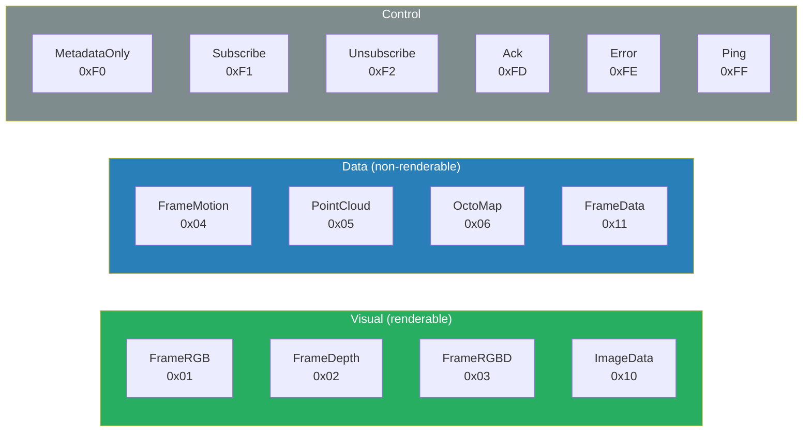
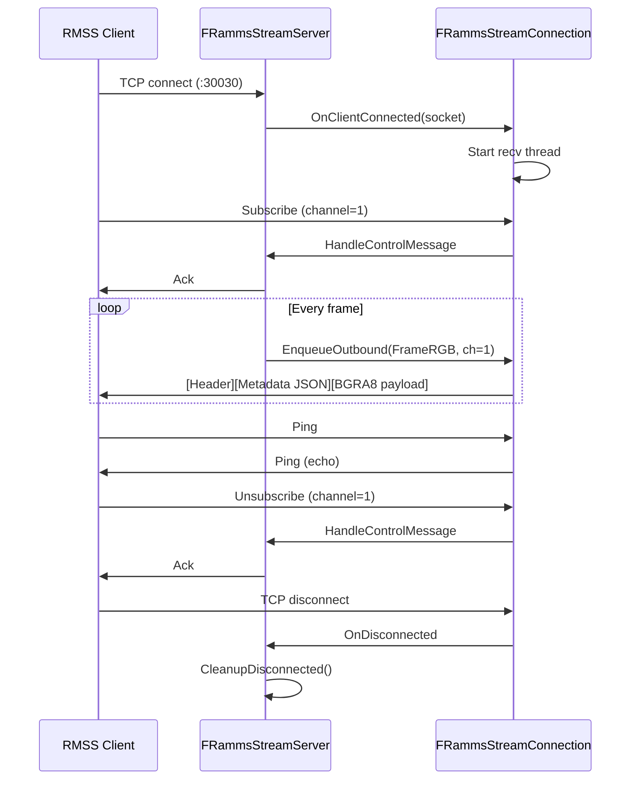
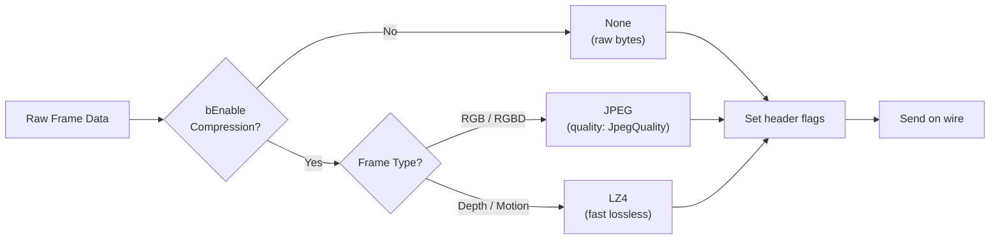

# RammsStreaming

Bidirectional TCP-based binary streaming plugin for real-time sensor data in the
**RAMMP** robotics project. Built on Unreal Engine 5.7, it uses a custom **RMSS**
(Ramms Stream) protocol to push and pull frames — RGB, depth, RGBD, motion vectors,
point clouds, and generic image data — between UE and external applications.

**Plugin dependency:** [CameraCapture](../CameraCapture/)

---

## Architecture



| Class | Role |
|---|---|
| **URammsStreamingSubsystem** | Game-instance subsystem. Owns the TCP server, manages connections, compression settings, and frame broadcasting. Persists across level transitions. |
| **FRammsStreamServer** | Threaded TCP listener (`FRunnable`). Accepts clients on a background thread, manages the connection pool, and broadcasts outbound messages to subscribers. |
| **FRammsStreamConnection** | Per-client handler with its own receive thread (`FRunnable`). Reads incoming RMSS messages into a thread-safe inbound queue; outbound messages are enqueued by the server and flushed during the server's send loop. |
| **URammsStreamSourceComponent** | Actor component bridging **CameraCapture** → RMSS server (outbound frames). Hooks into `CameraCaptureSubsystem::OnFrameCaptured` and forwards harvested frames. |
| **URammsStreamSinkComponent** | Actor component receiving frames from clients and surfacing them as `UTexture2D` resources for rendering, camera providers, or projection pipelines. |

---

## Data Flow

### Outbound: UE Scene → External Client

Scene capture data is forwarded to connected RMSS clients:



1. **CameraCapture** performs GPU readback of `SceneCaptureComponent2D` render targets
2. **SourceComponent** receives `FCaptureData` via delegate and builds metadata JSON (intrinsics, extrinsics, dimensions)
3. **Subsystem** optionally compresses the payload (JPEG for RGB, LZ4 for depth) and broadcasts to the server
4. **Server** filters by channel subscription and enqueues to each matching connection
5. **Connection** flushes its outbound queue to the TCP socket

### Inbound: External Client → UE Textures

External frames (e.g., from a robot's cameras via Python) are received and
converted to GPU textures:


1. **External client** connects to TCP port 30030, sends `Subscribe` control message for desired channels, then streams RMSS frame messages
2. **Connection** receive thread parses the RMSS binary protocol and queues complete messages
3. **Server.Tick()** (called on the game thread) dequeues inbound messages and fires `OnNativeMessageReceived`
4. **SinkComponent** matches channel IDs, decompresses payloads, and creates/updates `UTexture2D` (BGRA8 for color, R32F for depth, or arbitrary format via `"fmt"` metadata)
5. **Downstream consumers** (e.g., `URammsStreamCameraBridge` in the RammsUI plugin) receive the texture via `OnFrameReceived` delegate

### Threading Model



| Thread | Responsibility |
|---|---|
| **Game thread** | Subsystem tick, server tick (inbound dispatch + cleanup), sink texture creation, broadcast API calls |
| **Server thread** | TCP accept loop, outbound queue flushing for all connections |
| **Recv thread (×N)** | One per client — reads from socket, parses RMSS protocol, enqueues to inbound queue |

All cross-thread communication uses `FCriticalSection`-guarded arrays or
`TQueue`. The game thread never touches sockets directly.

---

## RMSS Protocol

Every message on the wire follows a fixed structure:

```
┌──────────────┬─────────────────────────┬───────────────────────┐
│  Header 32 B │  Metadata (UTF-8 JSON)  │  Payload (binary)     │
└──────────────┴─────────────────────────┴───────────────────────┘
```

### Header (32 bytes, little-endian)

```
Offset  Size  Field
──────  ────  ─────────────────────────────────────
0       4     Magic              "RMSS"
4       1     Version            1
5       1     MessageType        ERammsStreamMessageType
6       2     ChannelID          uint16 camera/stream identifier
8       2     Flags              uint16 bitfield (see below)
10      4     SequenceNum        uint32 monotonic counter
14      8     Timestamp          int64 microseconds since epoch
22      4     MetadataLen        uint32 JSON byte count
26      4     PayloadLen         uint32 binary payload byte count
30      2     Reserved           (zero)
```

**Flag bits:**

| Bit(s) | Name | Description |
|--------|------|-------------|
| 0 | `FLAG_COMPRESSED` | Payload is compressed |
| 1–2 | `FLAG_COMP_TYPE` | Compression codec (0=None, 1=LZ4, 2=JPEG, 3=PNG) |
| 3 | `FLAG_HAS_ALPHA` | Payload includes alpha channel |
| 4 | `FLAG_HIGH_PRIORITY` | Message should not be dropped under back-pressure |

### Message Types



| Category | Name | Value | Description |
|----------|------|-------|-------------|
| **Visual** | `FrameRGB` | `0x01` | BGRA8 colour frame |
| **Visual** | `FrameDepth` | `0x02` | float32 depth per pixel (cm) |
| **Visual** | `FrameRGBD` | `0x03` | Fused RGB + depth frame |
| **Visual** | `ImageData` | `0x10` | Generic image data (external → UE) |
| **Data** | `FrameMotion` | `0x04` | float32×2 motion / optical-flow vectors |
| **Data** | `PointCloud` | `0x05` | Point-cloud data |
| **Data** | `OctoMap` | `0x06` | OctoMap spatial data |
| **Data** | `FrameData` | `0x11` | Generic frame (pixel format described by `"fmt"` metadata) |
| **Control** | `MetadataOnly` | `0xF0` | Metadata-only (no payload) |
| **Control** | `Subscribe` | `0xF1` | Client subscribes to a channel |
| **Control** | `Unsubscribe` | `0xF2` | Client unsubscribes from a channel |
| **Control** | `Ack` | `0xFD` | Server acknowledgement |
| **Control** | `Error` | `0xFE` | Server error response |
| **Control** | `Ping` | `0xFF` | Keep-alive (bidirectional) |

### Client Connection Lifecycle



### Metadata JSON

The metadata block carries per-frame context as UTF-8 JSON:

```json
{
  "width": 1280,
  "height": 720,
  "format": "BGRA8",
  "intrinsics": { "fx": 918.5, "fy": 916.4, "cx": 641.3, "cy": 367.9 },
  "transform": { "position": [0, 0, 100], "rotation": [0, 0, 0, 1] }
}
```

Fields are optional and vary by message type. The `"format"` field is used by
`FrameData` messages to describe arbitrary pixel formats. Camera intrinsics and
extrinsics are forwarded from the CameraCapture subsystem by the source
component.

---

## Components

### URammsStreamingSubsystem (GameInstanceSubsystem)

Central manager for the streaming server and frame broadcasting.

| Method / Property | Description |
|---|---|
| `StartServer(Port, MaxClients)` | Start the TCP server (default: port 30030, 8 max clients). |
| `StopServer()` | Stop the server and disconnect all clients. |
| `IsServerRunning()` | Returns `true` if the server is accepting connections. |
| `GetConnectionCount()` | Number of active client connections. |
| `BroadcastRGBFrame(Channel, PixelData, W, H, Metadata)` | Push a BGRA8 RGB frame to all subscribers on a channel. |
| `BroadcastDepthFrame(Channel, DepthData, W, H, Metadata)` | Push a float32 depth frame. |
| `BroadcastRGBDFrame(Channel, PixelData, DepthData, W, H, Metadata)` | Push a fused RGBD frame. |
| `OnMessageReceived` | Blueprint delegate fired when an inbound message arrives. |
| `OnNativeMessageReceived` | Native (C++) delegate with full `FRammsStreamMessage` payload. |
| `bEnableCompression` | Global toggle — JPEG for RGB, LZ4 for depth. |
| `JpegQuality` | JPEG quality (1–100, default 85). |

### URammsStreamSourceComponent (ActorComponent)

Bridges the **CameraCapture** plugin into the RMSS server for outbound streaming.

| Property | Type | Description |
|---|---|---|
| `ChannelID` | `int32` | RMSS channel for this source (clients subscribe to channels). |
| `bStreamRGB` | `bool` | Forward RGB frames. |
| `bStreamDepth` | `bool` | Forward depth frames. |
| `bStreamRGBD` | `bool` | Forward fused RGBD (overrides individual RGB/Depth if true). |
| `CameraFilter` | `FString` | Only forward frames from cameras whose ID contains this string. |

### URammsStreamSinkComponent (ActorComponent)

Receives frames from connected clients and creates `UTexture2D` resources.

| Property / Method | Description |
|---|---|
| `ListenChannels` (`TArray<int32>`) | Channels this sink subscribes to. Empty = listen to all channels. |
| `OnFrameReceived` | Delegate: `(int32 Channel, UTexture2D* Texture, const FString& Metadata, ERammsStreamMessageType Type)` |
| `GetLatestTexture(ChannelID)` | Returns the most recent `UTexture2D` for a channel. |
| `GetLatestRawData(ChannelID, OutData)` | Copy latest raw pixel bytes for CPU consumers (e.g., CPU PGM). |
| `GetLatestPixelFormat(ChannelID)` | Returns `EPixelFormat` of the latest frame data. |

**Texture creation:** The sink automatically creates or updates per-channel
textures — BGRA8 for color (`ProcessImageMessage`), R32F or G16 for depth
(`ProcessDepthMessage`), or arbitrary format via `"fmt"` metadata
(`ProcessFrameDataMessage`). Texture updates happen on the game thread during
`TickComponent`.

**Format normalization:** The `fmt` metadata field is case-insensitive
(normalized to lowercase on parse), consistent across all `Process*` methods.

**Color format support:** `ProcessImageMessage` accepts `bgra8`, `rgba8`, and
`rgb8` formats. RGBA8 and RGB8 are converted to BGRA8 on CPU before texture
creation (GPU does not support `PF_R8G8B8` on D3D11/D3D12). After conversion,
the broadcast metadata `fmt` is rewritten to `"bgra8"` so downstream consumers
see the actual texture format.

**Depth format support:** `ProcessDepthMessage` supports both `float32`/R32F
(values in cm) and `16uc1`/G16 (uint16, values in mm). Format is auto-detected
from the `fmt` metadata field.

**Texture reuse safety:** Textures are recreated when pixel format changes (not
just dimensions), preventing format mismatch when a channel switches between
e.g. R32F and G16 depth.

**Texture caching:** New textures are only cached in `ChannelTextures` after the
first successful mip data write, preventing stale entries on creation failure.

**Overflow protection:** Large-frame pixel conversions (RGB8→BGRA8, RGBA8→BGRA8)
use `int64` arithmetic for size computations to prevent `int32` overflow on
large images.

### FRammsStreamServer (FRunnable)

Low-level TCP server managing the client connection pool.

| Method | Description |
|---|---|
| `StartListening()` / `StopListening()` | Start or stop the accept thread. |
| `BroadcastToSubscribers(Message)` | Send a message to all clients subscribed to the message's channel. Thread-safe. |
| `SendTo(ConnectionId, Message)` | Send a message to a specific client. |
| `Tick()` | Game-thread tick: flush outbound, dispatch inbound, cleanup dead connections. |

**Statistics** (atomic counters):

| Counter | Description |
|---|---|
| `TotalBytesSent` | Cumulative bytes sent to all clients. |
| `TotalBytesReceived` | Cumulative bytes received from all clients. |
| `FramesSent` | Total frames broadcast. |
| `FramesDropped` | Frames dropped due to full outbound queues. |
| `TotalConnectionsAccepted` | Lifetime count of accepted connections. |

### FRammsStreamConnection (FRunnable)

Per-client TCP handler running on its own receive thread.

| Property / Method | Description |
|---|---|
| `SubscribedChannels` (`TSet<uint16>`) | Channels this client wants to receive. |
| `PreferredCompression` | Compression requested by the client (`None`, `LZ4`, `JPEG`, `PNG`). |
| `EnqueueOutbound(Message, bDropOldest)` | Queue a message for sending. Drops oldest if queue is full (default: 3 messages max). |
| `FlushOutbound()` | Flush queued messages to the TCP socket (called by server thread). |
| `DequeueInbound(OutMessage)` | Retrieve the next received message (thread-safe). |
| `MaxOutboundQueueSize` | Per-connection back-pressure limit (default: 3). |

---

## Compression



| Mode | Description | Default Use |
|---|---|---|
| **None** | Raw, uncompressed bytes | Debugging, low-latency LAN |
| **LZ4** | Fast block compression (lossless) | Depth and motion-vector frames |
| **JPEG** | Lossy (quality configurable via `JpegQuality`) | RGB frames |
| **PNG** | Lossless | Colour frames requiring exact fidelity |

Compression is encoded in the header `Flags` field (bits 0–2) and can be
configured globally on the subsystem or per-client via `PreferredCompression`.

---

## Usage

### C++ — Broadcasting Frames (Outbound)

```cpp
// Get the streaming subsystem (persists across levels)
auto* StreamSub = GetGameInstance()->GetSubsystem<URammsStreamingSubsystem>();

// Start the server on port 30030
StreamSub->StartServer(30030, 8);

// Broadcast an RGB frame to channel 1
StreamSub->BroadcastRGBFrame(
    /*ChannelID=*/ 1,
    PixelData,      // TArray<uint8> BGRA8
    1280, 720,
    TEXT("{\"intrinsics\":{\"fx\":918.5,\"fy\":916.4,\"cx\":641.3,\"cy\":367.9}}")
);
```

### C++ — Receiving Frames (Inbound)

```cpp
// In your actor's BeginPlay:
SinkComponent->OnFrameReceived.AddDynamic(this, &AMyActor::OnFrame);

void AMyActor::OnFrame(int32 Channel, UTexture2D* Texture,
                        const FString& Metadata, ERammsStreamMessageType Type)
{
    // Texture is ready for materials, UMG Image widgets, etc.
    // For CPU access (e.g., PGM):
    TArray<uint8> RawData;
    if (SinkComponent->GetLatestRawData(Channel, RawData))
    {
        // Process raw pixel bytes...
    }
}
```

### Blueprint — Typical Setup

```
BP_MobileDisplay (Actor):
  ├── URammsStreamSinkComponent      (ListenChannels: [1, 2])
  ├── URammsStreamCameraBridge       (auto-discovers sink)
  └── URammsCameraProjectionManager  (consumes camera provider)

On BeginPlay:
  1. Get RammsStreamingSubsystem
  2. Call StartServer(30030)
  3. Sink begins receiving frames automatically
```

### Python Client

The companion **ramms_tools** package provides ready-made helpers:

```python
from ramms_tools import RammsClient

client = RammsClient("localhost", 30030)
client.subscribe(channel=1)          # Subscribe to channel 1
for frame in client.frames():
    # frame.image    — numpy array (H, W, 4) uint8 BGRA
    # frame.depth    — numpy array (H, W) float32
    # frame.metadata — dict with intrinsics, transform, etc.
    pass
```

---

## Port Assignment

| Service | Default Port |
|---|---|
| UE Remote Control (HTTP) | 30010 |
| UE Remote Control (WebSocket) | 30020 |
| **RMSS Binary Streaming** | **30030** |

The port is configurable on `URammsStreamingSubsystem` before calling
`StartServer()`.

---

## Plugin Dependencies

| Plugin | Reason |
|---|---|
| **CameraCapture** | Required by `URammsStreamSourceComponent` for GPU frame capture and readback. |
