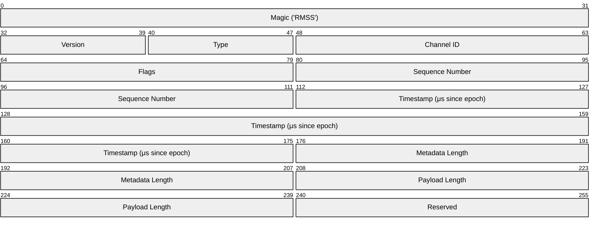

# RammsStreaming

Unreal Engine plugin that provides bidirectional binary streaming between UE and
external applications (e.g.&nbsp;Python) over TCP using the **RMSS** protocol.
Frames (RGB, depth, point clouds) flow out of UE via a source component and into
UE via a sink component, all managed by a game-instance subsystem.

## Architecture

```
┌─────────────────────────────────┐         TCP (port 30030)         ┌───────────────────┐
│  Unreal Engine                  │◄────────────────────────────────►│  External Client  │
│                                 │                                  │  (Python, C++, …) │
│  URammsStreamingSubsystem       │   RMSS binary protocol           │                   │
│   ├─ FRammsStreamServer         │   32-byte header + metadata +    │  StreamClient     │
│   │   └─ FRammsStreamConnection │   payload per message            │  StreamSender     │
│   ├─ URammsStreamSourceComponent│──► IMAGE_DATA / FRAME_DEPTH ──►  │                   │
│   └─ URammsStreamSinkComponent  │◄── IMAGE_DATA / FRAME_DEPTH ◄──  │                   │
└─────────────────────────────────┘                                  └───────────────────┘
```

| Class | Role |
|---|---|
| **URammsStreamingSubsystem** | Game-instance subsystem. Owns the TCP server, manages connections, compression settings, and frame broadcasting. |
| **FRammsStreamServer** | Low-level threaded TCP server (`FRunnable`). Listens on the configured port (default **30030**). |
| **FRammsStreamConnection** | Per-connection threaded handler. Reads/writes RMSS messages on its own thread. |
| **URammsStreamSourceComponent** | Actor component that bridges the **CameraCapture** subsystem into the RMSS server — forwards RGB and depth frames with camera metadata. |
| **URammsStreamSinkComponent** | Actor component that receives `IMAGE_DATA` / `FRAME_DEPTH` messages from external clients and creates `UTexture2D` resources for in-engine display. |

## RMSS Protocol

Every message on the wire has the layout:

```
[ Header 32 B ][ Metadata (variable) ][ Payload (variable) ]
```

The first 5 bytes of the header are the magic and version:

| Offset | Size | Value |
|--------|------|-------|
| 0 | 4 | `"RMSS"` (ASCII) |
| 4 | 1 | Protocol version (`1`) |

### Header (32 bytes, little-endian)



| Offset | Size | Field | Type | Description |
|--------|------|-------|------|-------------|
| 0 | 4 | `magic` | `char[4]` | `"RMSS"` |
| 4 | 1 | `version` | `uint8` | `1` |
| 5 | 1 | `message_type` | `uint8` | See message-type table below |
| 6 | 2 | `channel_id` | `uint16` | Per-stream channel identifier |
| 8 | 2 | `flags` | `uint16` | Compression & feature bitfield |
| 10 | 4 | `sequence_num` | `uint32` | Per-channel monotonic counter |
| 14 | 8 | `timestamp` | `int64` | Microseconds since epoch |
| 22 | 4 | `metadata_len` | `uint32` | Byte length of UTF-8 JSON metadata |
| 26 | 4 | `payload_len` | `uint32` | Byte length of binary payload |
| 30 | 2 | _reserved_ | `uint16` | Zero padding |

**Flag bits:**

| Bit | Mask | Name |
|-----|------|------|
| 0 | `0x0001` | Compressed |
| 1–2 | `0x0006` | Compression type (1=LZ4, 2=JPEG, 3=PNG) |
| 3 | `0x0008` | Has alpha channel |
| 4 | `0x0010` | High priority |

### Message Types

| Name | Value | Direction | Description |
|------|-------|-----------|-------------|
| `IMAGE_DATA` | `0x10` | Both | RGB / colour frame |
| `FRAME_DEPTH` | `0x02` | Both | Depth frame |
| `FRAME_MOTION` | `0x03` | Both | Motion / optical-flow frame |
| `POINT_CLOUD` | `0x04` | Both | Point-cloud data |
| `SUBSCRIBE` | `0x20` | Client → Server | Subscribe to a channel |
| `UNSUBSCRIBE` | `0x21` | Client → Server | Unsubscribe from a channel |
| `ACK` | `0x30` | Server → Client | Acknowledgement |
| `ERROR` | `0x31` | Server → Client | Error response |
| `PING` | `0x40` | Both | Keep-alive ping |

### Metadata JSON

The metadata block is a UTF-8 JSON object. Typical fields:

| Key | Type | Example | Description |
|-----|------|---------|-------------|
| `w` | int | `1920` | Frame width in pixels |
| `h` | int | `1080` | Frame height in pixels |
| `fmt` | string | `"bgra8"`, `"float32"` | Pixel format |
| `intrinsics` | object | `{"fx":600,"fy":600,"cx":960,"cy":540}` | Camera intrinsics |
| `transform` | object | `{"x":0,"y":0,"z":100,"pitch":0,"yaw":0,"roll":0}` | Camera pose |
| `transform_space` | string | `"world"` or `"relative"` | Coordinate space of the transform |

## Compression

Set compression per-channel on the subsystem or per-component.

| Enum Value (`ERammsStreamCompression`) | Description | Best For |
|---|---|---|
| `None` | Raw, uncompressed bytes | Debugging, low-latency LAN |
| `LZ4` | LZ4 block compression | Depth / float data |
| `JPEG` | JPEG compression (quality 1–100) | RGB frames |
| `PNG` | PNG lossless compression | Lossless colour frames |

JPEG quality is configurable via the subsystem (default 85).

## Component Usage

### Sending Frames Out (UE → External)

1. Add a **URammsStreamSourceComponent** to any actor with a camera.
2. The component hooks into the **CameraCapture** plugin and forwards
   captured RGB and depth frames to all connected RMSS clients.
3. Configure channel ID and compression on the component's details panel.

```cpp
// Example: attach a source component in C++
auto* Src = NewObject<URammsStreamSourceComponent>(MyActor);
Src->ChannelId = 1;
Src->Compression = ERammsStreamCompression::JPEG;
Src->RegisterComponent();
```

### Receiving Frames In (External → UE)

1. Add a **URammsStreamSinkComponent** to any actor.
2. The component listens for `IMAGE_DATA` / `FRAME_DEPTH` messages on its
   assigned channel and creates a `UTexture2D` you can bind to a material.
3. Poll `GetTexture()` or bind the `OnFrameReceived` delegate for updates.

```cpp
auto* Sink = NewObject<URammsStreamSinkComponent>(MyActor);
Sink->ChannelId = 1;
Sink->RegisterComponent();

// In Tick or delegate:
UTexture2D* Tex = Sink->GetTexture();
```

## Quick Start

1. **Enable the plugin** — add `RammsStreaming` (and its dependency
   `CameraCapture`) to your `.uproject` or `.uplugin` file.
2. **Place a source** — drop a `RammsStreamSourceComponent` onto your
   camera actor. Frames will be broadcast on the default channel as soon as a
   client connects.
3. **Connect externally** — open a TCP socket to `localhost:30030` and start
   reading RMSS messages (see Python section below).
4. **Send frames in** — use `RammsStreamSinkComponent` on the UE side and
   push `IMAGE_DATA` messages from your external application.

## Python Interop

The companion **ramms-tools** package provides ready-made helpers:

```python
from ramms.streaming import StreamClient, StreamSender

# Receive frames from UE
client = StreamClient("127.0.0.1", 30030)
for frame in client.frames(channel=1):
    rgb = frame.to_numpy()  # (H, W, 4) uint8 BGRA

# Send frames into UE
sender = StreamSender("127.0.0.1", 30030)
sender.send_image(channel=2, image=my_numpy_array, compression="jpeg")
```

See the `ramms-tools` repository for full API documentation.

## Port Assignments

| Service | Port |
|---|---|
| UE Remote Control (HTTP) | 30010 |
| UE Remote Control (WebSocket) | 30020 |
| **RMSS Binary Streaming** | **30030** |

## Plugin Dependencies

| Plugin | Reason |
|---|---|
| **CameraCapture** | Required by `URammsStreamSourceComponent` for frame capture |
